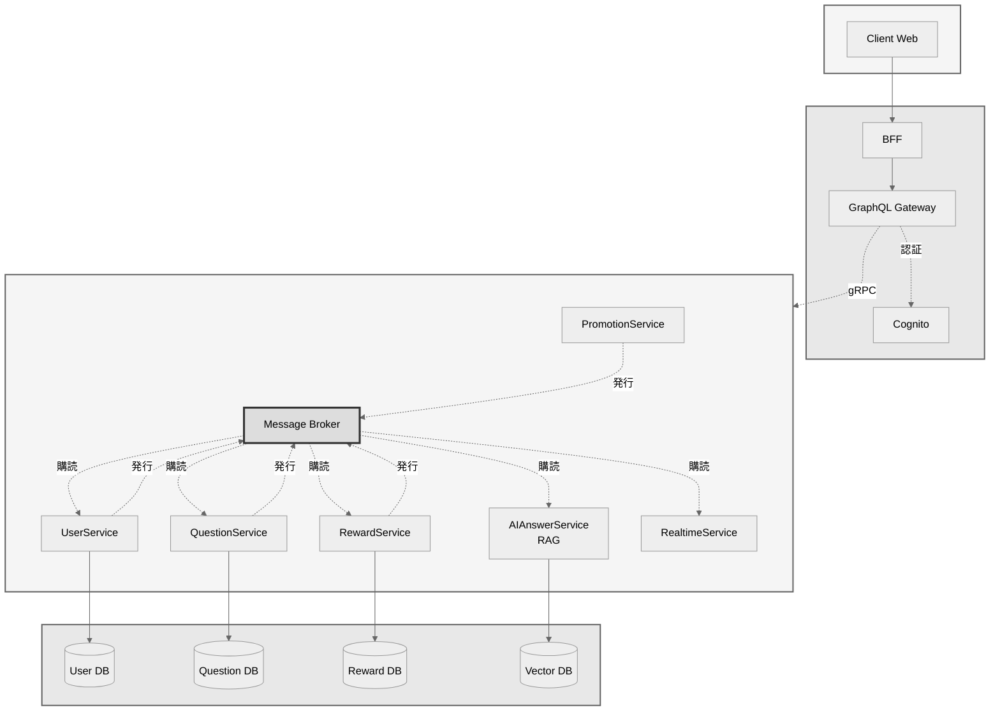

# アーキテクチャ設計

## 1. 全体構成図



## 2. 主要コンポーネント

### 2.1. API Gateway
システム全体の単一エントリーポイント（門番）。主な責務は以下の通り。
- **リクエストルーティング**: パスに基づき、リクエストを適切なBFFやマイクロサービスに転送する。
- **認証・認可**: Cognitoオーソライザーと連携し、全てのAPIリクエストのJWTを検証する。
- **横断的関心事**: 流量制限、ロギング、SSL終端などを一元的に担う。

### 2.2. BFF (Backend for Frontend)
Webアプリケーション（フロントエンド）専用のバックエンド。主な責務は以下の通り。
- **データ集約・加工**: クライアントの画面表示要求に応じて、複数のマイクロサービスからデータを集約・加工し、UIに最適化されたレスポンスを生成する。

### 2.3. Microservices
各ビジネスドメインに責務を持つサービス群。
- **UserService**: ユーザー情報の管理（プロフィール、設定など）。認証そのものはAPI Gateway + Cognitoが担う。
- **QuestionService**: 質問、回答の管理
- **RewardService**: リワード計算、支払い処理
- **PromotionService**: 広告、イベント管理
- **AIAnswerService**: **RAGモデル**を利用したAI回答の生成
- **RealtimeService**: **WebSocket**によるリアルタイムな双方向通信を提供（通知など）

### 2.4. Message Broker (イベント駆動)
サービス間の非同期通信を実現する。
- **イベント発行**: 各サービスは自身のドメインで発生したイベント（例: `AnswerCreated`）を発行する。
- **イベント購読**: 他のサービスは、関心のあるイベントを購読し、それぞれの処理を実行する（コレオグラフィ）。
- **技術候補**: RabbitMQ, Kafka, AWS SNS/SQSなど。

---

## 3. ドメインモデル (Entity)
本サービスのドメインモデルは、ドメイン駆動設計（DDD）のアプローチを採用する。

### 集約ルート（Aggregate Roots）
- User（サブタイプ：GeneralUser, Professional）
- Conversation（内包エンティティ：Question, 参加者リストを持つ）
- Question（内包エンティティ：Answer）
- Subscription / Ticket（ユーザーの権利）
- Promotion（広告的配信）
- Event（オンライン講演会）

### 値オブジェクト（Value Objects）
Money, Currency, Category, Tag, QuestionDifficulty, RewardAmount, Timestamp

### ドメインサービス
RewardCalculator
RecommendationService（質問→プロのマッチング）
AIAnswerService（AI初期回答）
QualityAssessmentService（評価集計・スパム判定）

### リポジトリ（interfaces）
- UserRepository, QuestionRepository, PromotionRepository, EventRepository, SubscriptionRepository

### ドメインイベント
AnswerCreated, RewardPaid, QuestionTrending, LowQualityAnswerDetected

---
## 4. リポジトリ構成
本プロジェクトは、多言語マイクロサービスを単一リポジトリで管理するモノリポ構成を採用する。

### 4.1. トップレベルディレクトリ
Goの標準的なプロジェクトレイアウトをベースとし、マイクロサービスの独立性を重視した構成を定める。

```
/ (プロジェクトルート)
├── protos/           # API定義 (Protobufファイル)
├── gen/              # 生成されたコード (go, tsなど)
├── cmd/              # 各マイクロサービスのmainパッケージ
│   └── {service-name}/
│       └── main.go
├── internal/         # 各サービス固有のプライベートなGoコード
│   └── {service-name}/
│       └── ...
├── pkg/              # 複数のサービスで共有されうる横断的ライブラリコード
├── services/         # Go以外の言語で実装されたサービスのロジック
├── configs/          # 設定ファイル
├── docs/             # ドキュメント
└── ...
```

*   **`/internal`**: 各サービスのビジネスロジックを配置する。Goの仕様により、例えば `internal/userservice` と `internal/questionservice` は互いにインポートできず、サービス間の独立性がコンパイラレベルで保証される。
*   **`/pkg`**: ドメインに依存しない、複数のサービスで共有したい汎用的な横断的関心事（共通ロガー、カスタムエラー、設定読み込み等）を配置する。

### 4.2. サービス内部のディレクトリ構成
`internal` ディレクトリは、各サービスのロジックを実装する `{service-name}/` パッケージ群と、インフラストラクチャ層との接続を担う `adapter/` パッケージで構成される。

```
/internal/
├── {service-name}/
│   ├── server.go         # gRPCサーバー実装 (プレゼンテーション層)
│   ├── usecase.go        # ビジネスロジックの実装 (アプリケーション層)
│   ├── converter.go      # DTOとドメインエンティティの相互変換
│   └── domain/
│       └── {entity}/
│           ├── model.go      # ドメインエンティティの定義 (ドメイン層)
│           └── repository.go # ★リポジトリインターフェースの定義
│
└── adapter/
    └── repository/
        └── {entity}_repository.go # ★リポジトリインターフェースの具体的な実装
```

*   **`server.go`**: gRPCリクエストの受付とレスポンス返却に責任を持つ。`usecase` に処理を移譲する。
*   **`usecase.go`**: ビジネスユースケースの手順を実行（オーケストレーション）する。`domain` で定義されたリポジトリ**インターフェース**に依存する。
*   **`domain/`**: サービス固有のドメインモデル（エンティティ）と、その永続化のためのリポジトリ**インターフェース**を定義する。
*   **`adapter/repository/`**: `domain` で定義されたリポジトリインターフェースの**具体的な実装**を配置する。`database/sql` などを利用し、実際のDBとの通信処理を記述する。

この構成により、ビジネスロジック (`usecase`, `domain`) は、インフラストラクチャ（DBの種類など）の詳細から完全に分離される（依存性逆転の原則）。