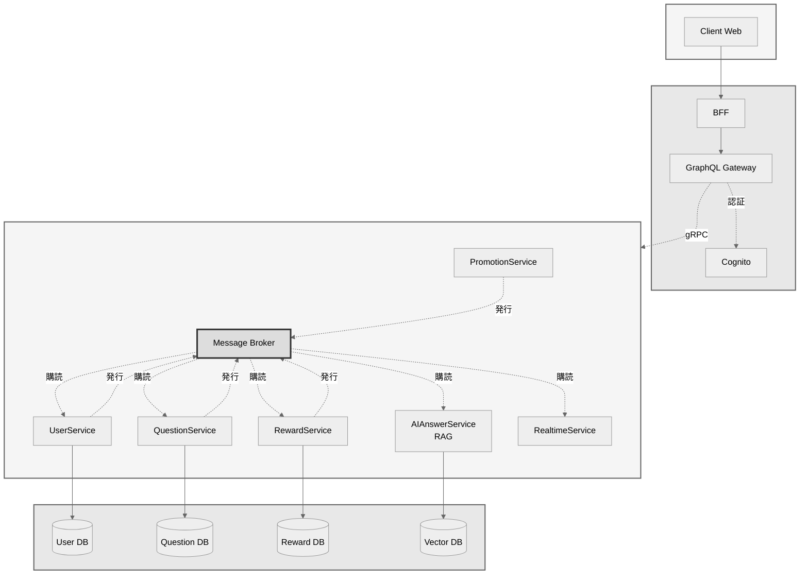

# アーキテクチャ設計

## 1. 全体構成図



## 2. 主要コンポーネント

### 2.1. API Gateway
システム全体の単一エントリーポイント（門番）。主な責務は以下の通り。
- **リクエストルーティング**: パスに基づき、リクエストを適切なBFFやマイクロサービスに転送する。
- **認証・認可**: Cognitoオーソライザーと連携し、全てのAPIリクエストのJWTを検証する。
- **横断的関心事**: 流量制限、ロギング、SSL終端などを一元的に担う。

### 2.2. BFF (Backend for Frontend)
Webアプリケーション（フロントエンド）専用のバックエンド。主な責務は以下の通り。
- **データ集約・加工**: クライアントの画面表示要求に応じて、複数のマイクロサービスからデータを集約・加工し、UIに最適化されたレスポンスを生成する。

### 2.3. Microservices
各ビジネスドメインに責務を持つサービス群。
- **UserService**: ユーザー情報の管理（プロフィール、設定など）。認証そのものはAPI Gateway + Cognitoが担う。
- **QuestionService**: 質問、回答の管理
- **RewardService**: リワード計算、支払い処理
- **PromotionService**: 広告、イベント管理
- **AIAnswerService**: **RAGモデル**を利用したAI回答の生成
- **RealtimeService**: **WebSocket**によるリアルタイムな双方向通信を提供（通知など）

### 2.4. Message Broker (イベント駆動)
サービス間の非同期通信を実現する。
- **イベント発行**: 各サービスは自身のドメインで発生したイベント（例: `AnswerCreated`）を発行する。
- **イベント購読**: 他のサービスは、関心のあるイベントを購読し、それぞれの処理を実行する（コレオグラフィ）。
- **技術候補**: RabbitMQ, Kafka, AWS SNS/SQSなど。

---

## 3. ドメインモデル (Entity)
本サービスのドメインモデルは、ドメイン駆動設計（DDD）のアプローチを採用する。

### 集約ルート（Aggregate Roots）
- User（サブタイプ：GeneralUser, Professional）
- Conversation（内包エンティティ：Question, 参加者リストを持つ）
- Question（内包エンティティ：Answer）
- Subscription / Ticket（ユーザーの権利）
- Promotion（広告的配信）
- Event（オンライン講演会）

### 値オブジェクト（Value Objects）
Money, Currency, Category, Tag, QuestionDifficulty, RewardAmount, Timestamp

### ドメインサービス
RewardCalculator
RecommendationService（質問→プロのマッチング）
AIAnswerService（AI初期回答）
QualityAssessmentService（評価集計・スパム判定）

### リポジトリ（interfaces）
- UserRepository, QuestionRepository, PromotionRepository, EventRepository, SubscriptionRepository

### ドメインイベント
AnswerCreated, RewardPaid, QuestionTrending, LowQualityAnswerDetected

---
## 4. リポジトリ構成
本プロジェクトは、多言語マイクロサービスを単一リポジトリで管理するモノリポ構成を採用する。ディレクトリ構造は、Goの標準的なプロジェクトレイアウトをベースとし、以下のように定める。

```
/ (プロジェクトルート)
├── protos/           # API定義 (Protobufファイルなど)
├── gen/              # 生成されたコード (go, pythonなど)
├── cmd/              # 各マイクロサービスのmainパッケージと実行ファイル
├── internal/         # アプリケーション固有のプライベートなGoコード
├── services/         # Go以外の言語で実装されたサービスのロジック
├── pkg/              # 複数のサービス間で共有されうるライブラリコード
├── configs/          # 設定ファイル
├── docs/             # ドキュメント
├── build/            # DockerfileやCI/CD関連のファイル
├── go.mod            # Goモジュール定義
├── requirements.txt  # Pythonの依存関係
└── docker-compose.yml # Docker Compose定義ファイル
```

### 主要ディレクトリの役割
- **`/cmd`**: 各サービスの起動エントリーポイント (`main` パッケージ) を配置する。
- **`/internal`**: Goで実装された各サービスのビジネスロジックを配置する。リポジトリ外からのインポートはGoの仕様により禁止される。
- **`/services`**: Pythonなど、Go以外の言語で実装されたサービスのビジネスロジックを配置する。
- **`/pkg`**: 複数のサービスで共通して利用するような、公開ライブラリコードを配置する。
- **`/protos`**: 全てのgRPC API定義とイベントスキーマの `.proto` ファイルを配置する。単一の信頼できる情報源 (Single Source of Truth) として機能する。
- **`/gen`**: `/protos` から各言語のコードを自動生成するための出力先ディレクトリ。
- **`/build`**: 各サービスの `Dockerfile` やCI/CDのパイプライン定義などを配置する。