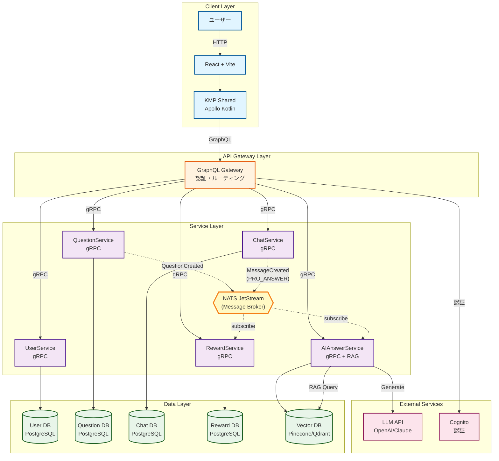
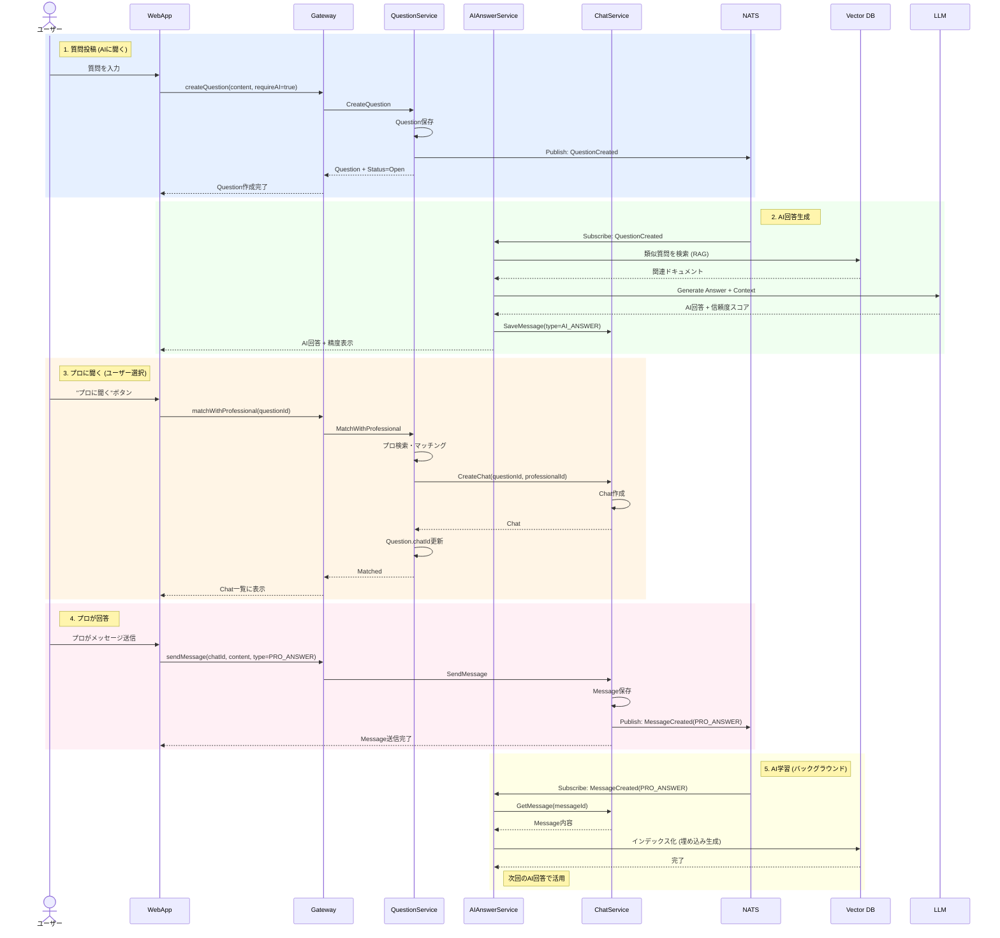
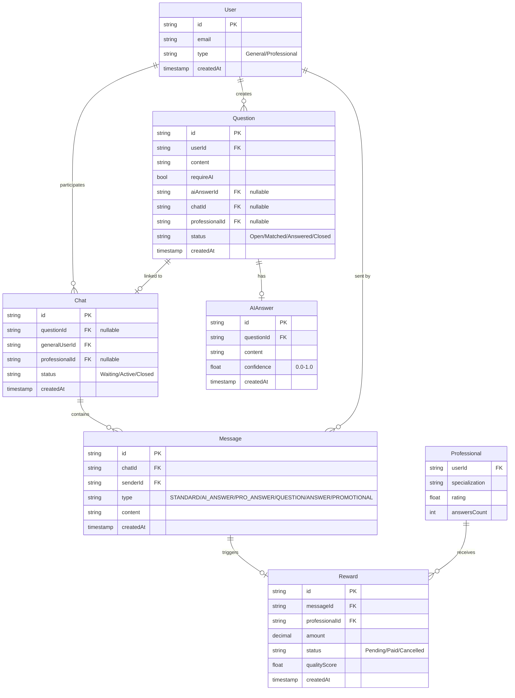
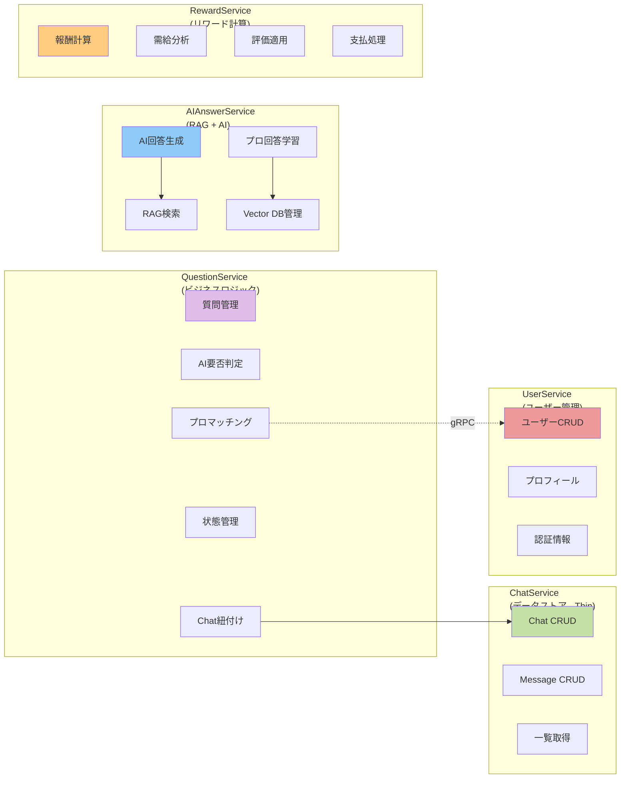
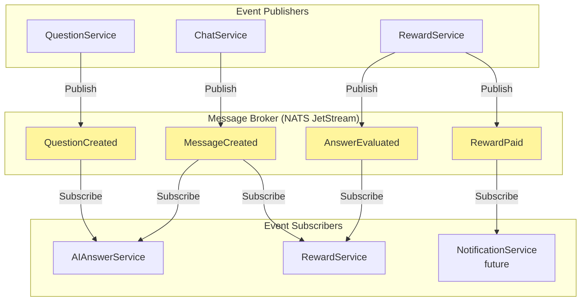
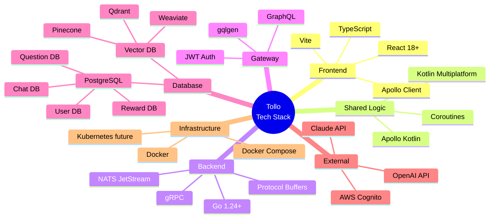
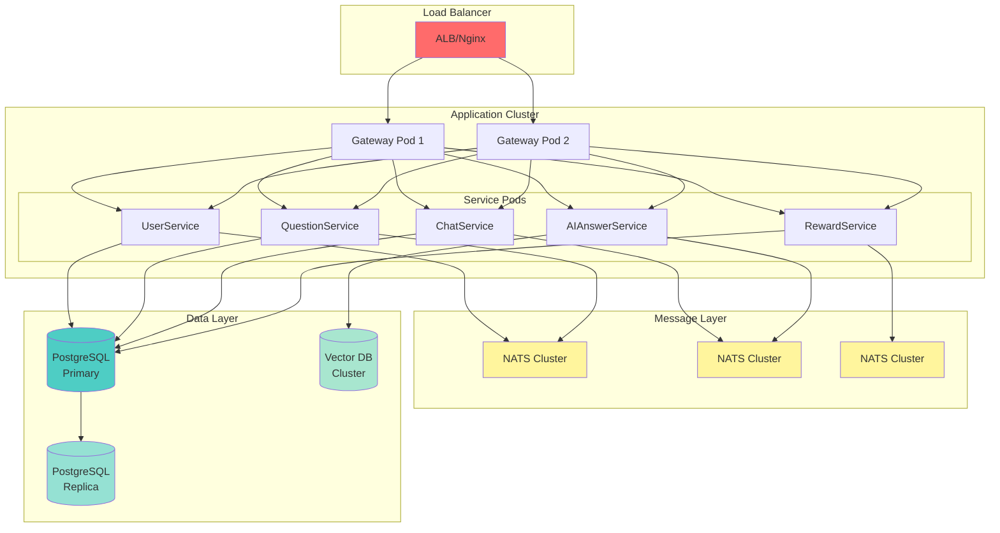

# システム全体像

## アーキテクチャ概要図

```mermaid
graph TB
    subgraph "Client Layer"
        User[ユーザー]
        WebApp[React + Vite]
        KMP[KMP Shared<br/>Apollo Kotlin]
    end

    subgraph "API Gateway Layer"
        Gateway[GraphQL Gateway<br/>認証・ルーティング]
    end

    subgraph "Service Layer"
        US[UserService<br/>gRPC]
        QS[QuestionService<br/>gRPC]
        CS[ChatService<br/>gRPC]
        AIS[AIAnswerService<br/>gRPC + RAG]
        RS[RewardService<br/>gRPC]

        MB{{"NATS JetStream<br/>(Message Broker)"}}
    end

    subgraph "Data Layer"
        UDB[(User DB<br/>PostgreSQL)]
        QDB[(Question DB<br/>PostgreSQL)]
        CDB[(Chat DB<br/>PostgreSQL)]
        RDB[(Reward DB<br/>PostgreSQL)]
        VDB[(Vector DB<br/>Pinecone/Qdrant)]
    end

    subgraph "External Services"
        LLM[LLM API<br/>OpenAI/Claude]
        Auth[Cognito<br/>認証]
    end

    %% User Flow
    User -->|HTTP| WebApp
    WebApp --> KMP
    KMP -->|GraphQL| Gateway
    Gateway -->|認証| Auth

    %% Gateway to Services
    Gateway -->|gRPC| US
    Gateway -->|gRPC| QS
    Gateway -->|gRPC| CS
    Gateway -->|gRPC| AIS
    Gateway -->|gRPC| RS

    %% Service to DB
    US --> UDB
    QS --> QDB
    CS --> CDB
    RS --> RDB
    AIS --> VDB

    %% Event-Driven (NATS)
    QS -.QuestionCreated.-> MB
    CS -.MessageCreated<br/>(PRO_ANSWER).-> MB
    MB -.subscribe.-> AIS
    MB -.subscribe.-> RS

    %% AI Service
    AIS -->|RAG Query| VDB
    AIS -->|Generate| LLM

    %% Styling
    classDef client fill:#e1f5ff,stroke:#01579b,stroke-width:2px
    classDef gateway fill:#fff3e0,stroke:#e65100,stroke-width:2px
    classDef service fill:#f3e5f5,stroke:#4a148c,stroke-width:2px
    classDef datastore fill:#e8f5e9,stroke:#1b5e20,stroke-width:2px
    classDef broker fill:#fff9c4,stroke:#f57f17,stroke-width:3px
    classDef external fill:#fce4ec,stroke:#880e4f,stroke-width:2px

    class User,WebApp,KMP client
    class Gateway gateway
    class US,QS,CS,AIS,RS service
    class UDB,QDB,CDB,RDB,VDB datastore
    class MB broker
    class LLM,Auth external
```

## ユーザーフロー詳細図

```mermaid
sequenceDiagram
    actor U as ユーザー
    participant W as WebApp
    participant G as Gateway
    participant Q as QuestionService
    participant A as AIAnswerService
    participant C as ChatService
    participant M as NATS
    participant V as Vector DB
    participant L as LLM

    %% 質問投稿フロー
    rect rgb(230, 240, 255)
        note right of U: 1. 質問投稿 (AIに聞く)
        U->>W: 質問を入力
        W->>G: createQuestion(content, requireAI=true)
        G->>Q: CreateQuestion
        Q->>Q: Question保存
        Q->>M: Publish: QuestionCreated
        Q-->>G: Question + Status=Open
        G-->>W: Question作成完了
    end

    %% AI回答生成フロー
    rect rgb(240, 255, 240)
        note right of M: 2. AI回答生成
        M->>A: Subscribe: QuestionCreated
        A->>V: 類似質問を検索 (RAG)
        V-->>A: 関連ドキュメント
        A->>L: Generate Answer + Context
        L-->>A: AI回答 + 信頼度スコア
        A->>C: SaveMessage(type=AI_ANSWER)
        A-->>W: AI回答 + 精度表示
    end

    %% プロマッチングフロー
    rect rgb(255, 245, 230)
        note right of U: 3. プロに聞く (ユーザー選択)
        U->>W: "プロに聞く"ボタン
        W->>G: matchWithProfessional(questionId)
        G->>Q: MatchWithProfessional
        Q->>Q: プロ検索・マッチング
        Q->>C: CreateChat(questionId, professionalId)
        C->>C: Chat作成
        C-->>Q: Chat
        Q->>Q: Question.chatId更新
        Q-->>G: Matched
        G-->>W: Chat一覧に表示
    end

    %% プロ回答フロー
    rect rgb(255, 240, 245)
        note right of U: 4. プロが回答
        U->>W: プロがメッセージ送信
        W->>G: sendMessage(chatId, content, type=PRO_ANSWER)
        G->>C: SendMessage
        C->>C: Message保存
        C->>M: Publish: MessageCreated(PRO_ANSWER)
        C-->>W: Message送信完了
    end

    %% RAG学習フロー
    rect rgb(255, 255, 230)
        note right of M: 5. AI学習 (バックグラウンド)
        M->>A: Subscribe: MessageCreated(PRO_ANSWER)
        A->>C: GetMessage(messageId)
        C-->>A: Message内容
        A->>V: インデックス化 (埋め込み生成)
        V-->>A: 完了
        note right of A: 次回のAI回答で活用
    end
```

## データモデル関連図

```mermaid
erDiagram
    User ||--o{ Question : creates
    User ||--o{ Chat : participates
    Question ||--o| Chat : "linked to"
    Question ||--o| AIAnswer : "has"
    Chat ||--o{ Message : contains
    Message }o--|| User : "sent by"
    Message ||--o| Reward : "triggers"
    Professional ||--o{ Reward : receives

    User {
        string id PK
        string email
        string type "General/Professional"
        timestamp createdAt
    }

    Question {
        string id PK
        string userId FK
        string content
        bool requireAI
        string aiAnswerId FK "nullable"
        string chatId FK "nullable"
        string professionalId FK "nullable"
        string status "Open/Matched/Answered/Closed"
        timestamp createdAt
    }

    Chat {
        string id PK
        string questionId FK "nullable"
        string generalUserId FK
        string professionalId FK "nullable"
        string status "Waiting/Active/Closed"
        timestamp createdAt
    }

    Message {
        string id PK
        string chatId FK
        string senderId FK
        string type "STANDARD/AI_ANSWER/PRO_ANSWER/QUESTION/ANSWER/PROMOTIONAL"
        string content
        timestamp createdAt
    }

    AIAnswer {
        string id PK
        string questionId FK
        string content
        float confidence "0.0-1.0"
        timestamp createdAt
    }

    Reward {
        string id PK
        string messageId FK
        string professionalId FK
        decimal amount
        string status "Pending/Paid/Cancelled"
        float qualityScore
        timestamp createdAt
    }

    Professional {
        string userId FK
        string specialization
        float rating
        int answersCount
    }
```

## サービス責任分離図

```mermaid
graph LR
    subgraph "QuestionService<br/>(ビジネスロジック)"
        Q1[質問管理]
        Q2[AI要否判定]
        Q3[プロマッチング]
        Q4[状態管理]
        Q5[Chat紐付け]
    end

    subgraph "ChatService<br/>(データストア - Thin)"
        C1[Chat CRUD]
        C2[Message CRUD]
        C3[一覧取得]
    end

    subgraph "AIAnswerService<br/>(RAG + AI)"
        A1[AI回答生成]
        A2[RAG検索]
        A3[Vector DB管理]
        A4[プロ回答学習]
    end

    subgraph "RewardService<br/>(リワード計算)"
        R1[報酬計算]
        R2[需給分析]
        R3[評価適用]
        R4[支払処理]
    end

    subgraph "UserService<br/>(ユーザー管理)"
        U1[ユーザーCRUD]
        U2[プロフィール]
        U3[認証情報]
    end

    Q3 -.gRPC.-> U1
    Q5 --> C1
    A1 --> A2
    A4 --> A3

    style Q1 fill:#e1bee7
    style C1 fill:#c5e1a5
    style A1 fill:#90caf9
    style R1 fill:#ffcc80
    style U1 fill:#ef9a9a
```

## イベント駆動フロー図

```mermaid
graph TB
    subgraph "Event Publishers"
        QS[QuestionService]
        CS[ChatService]
        RS[RewardService]
    end

    subgraph "Message Broker (NATS JetStream)"
        E1[QuestionCreated]
        E2[MessageCreated]
        E3[AnswerEvaluated]
        E4[RewardPaid]
    end

    subgraph "Event Subscribers"
        AIS[AIAnswerService]
        RS2[RewardService]
        NS[NotificationService<br/>future]
    end

    QS -->|Publish| E1
    CS -->|Publish| E2
    RS -->|Publish| E3
    RS -->|Publish| E4

    E1 -->|Subscribe| AIS
    E2 -->|Subscribe| AIS
    E2 -->|Subscribe| RS2
    E3 -->|Subscribe| RS2
    E4 -->|Subscribe| NS

    style E1 fill:#fff59d
    style E2 fill:#fff59d
    style E3 fill:#fff59d
    style E4 fill:#fff59d
```

## 技術スタック詳細

```mermaid
mindmap
    root((Tollo<br/>Tech Stack))
        Frontend
            React 18+
            TypeScript
            Vite
            Apollo Client
        Shared Logic
            Kotlin Multiplatform
            Apollo Kotlin
            Coroutines
        Backend
            Go 1.24+
            gRPC
            Protocol Buffers
            NATS JetStream
        Gateway
            GraphQL
            gqlgen
            JWT Auth
        Database
            PostgreSQL
                User DB
                Question DB
                Chat DB
                Reward DB
            Vector DB
                Pinecone
                Qdrant
                Weaviate
        External
            OpenAI API
            Claude API
            AWS Cognito
        Infrastructure
            Docker
            Docker Compose
            Kubernetes future
```

## デプロイメント構成 (将来)

```mermaid
graph TB
    subgraph "Load Balancer"
        LB[ALB/Nginx]
    end

    subgraph "Application Cluster"
        GW1[Gateway Pod 1]
        GW2[Gateway Pod 2]

        subgraph "Service Pods"
            US1[UserService]
            QS1[QuestionService]
            CS1[ChatService]
            AIS1[AIAnswerService]
            RS1[RewardService]
        end
    end

    subgraph "Message Layer"
        NATS1[NATS Cluster]
        NATS2[NATS Cluster]
        NATS3[NATS Cluster]
    end

    subgraph "Data Layer"
        PG1[(PostgreSQL<br/>Primary)]
        PG2[(PostgreSQL<br/>Replica)]
        VDB1[(Vector DB<br/>Cluster)]
    end

    LB --> GW1
    LB --> GW2

    GW1 --> US1
    GW1 --> QS1
    GW1 --> CS1
    GW1 --> AIS1
    GW1 --> RS1

    GW2 --> US1
    GW2 --> QS1
    GW2 --> CS1
    GW2 --> AIS1
    GW2 --> RS1

    US1 --> NATS1
    QS1 --> NATS1
    CS1 --> NATS2
    AIS1 --> NATS2
    RS1 --> NATS3

    US1 --> PG1
    QS1 --> PG1
    CS1 --> PG1
    RS1 --> PG1

    PG1 --> PG2
    AIS1 --> VDB1

    style LB fill:#ff6b6b
    style NATS1 fill:#fff59d
    style NATS2 fill:#fff59d
    style NATS3 fill:#fff59d
    style PG1 fill:#4ecdc4
    style PG2 fill:#95e1d3
    style VDB1 fill:#a8e6cf
```